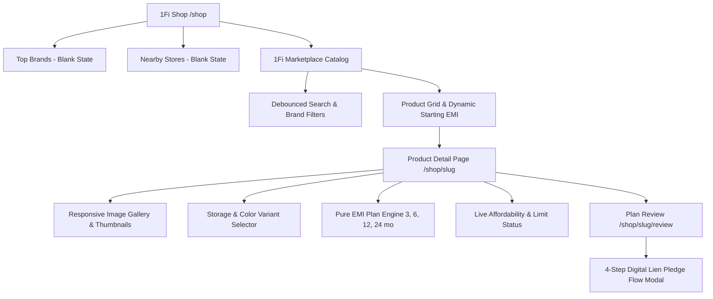

# 1Fi Marketplace — Software Development Engineer Intern Assessment

> **1Fi Marketplace Extension inside the Existing 1Fi Mobile Experience**  
> Built by **vikas9892** (`vikast4843@gmail.com`)

---

## Executive Summary & Product Interpretation

**1Fi** is fundamentally different from a conventional e-commerce platform. Its core value proposition is enabling investors to leverage their existing mutual fund holdings as collateral (Loan Against Mutual Funds - LAMF) to purchase products with **0% / No-Cost EMI** without liquidating their investments or sacrificing compounding returns.

This submission is designed strictly as a **product extension**, not a redesign or generic e-commerce template:
1. **Existing Shop Page Preservation**: Preserves 1Fi's exact mobile layout, `#712CDC` brand identity, hero banner, bottom navigation, and introduces the required **3-tab structure**:
   - **Top Brands**: Blank/coming-soon placeholder state.
   - **Nearby Stores**: Blank/coming-soon placeholder state.
   - **1Fi Marketplace**: Full end-to-end catalog, variant switcher, pure financial EMI calculation engine, real-time limit/affordability verification, and plan review.
2. **Fintech UX & Mutual Fund Transparency**: Every screen reinforces the financial relationship: price after cashback, transparent EMI tenures (3, 6, 12, 24 months), mutual fund lien pledge through SEBI-registered RTAs (CAMS, KFintech, MFCentral), and clear regulatory distinction between 1Fi (point-of-sale checkout tech) and regulated NBFC lending partners (Tata Capital, Bajaj Finserv, DSP Finance).
3. **Pure Financial Calculations**: Financial calculations (0% EMI, reducing-balance amortized APR, interest breakdown, and affordability shortfall) are implemented in pure, typed, independently testable modules with zero JSX or React dependencies.

---

## Information Architecture & User Journey



---

## Technical Architecture & Folder Structure

```
1Fi/
├── src/
│   ├── app/
│   │   ├── layout.tsx                     # Root layout with theme #712CDC, viewport, Geist font
│   │   ├── page.tsx                       # Seamless redirect to /shop
│   │   ├── globals.css                    # Design tokens, custom scrollbar utilities, glassmorphism
│   │   ├── shop/
│   │   │   ├── page.tsx                   # Existing Shop page with 3-tab layout
│   │   │   ├── [slug]/
│   │   │   │   ├── page.tsx               # PDP Server Component (dynamic SEO metadata)
│   │   │   │   └── review/
│   │   │   │       └── page.tsx           # Plan Review Server Component
│   │   └── api/
│   │       ├── products/
│   │       │   ├── route.ts               # GET /api/products (filter by brand, search)
│   │       │   └── [slug]/
│   │       │       └── route.ts           # GET /api/products/[slug] with 404 handling
│   │       └── emi-plans/
│   │           └── route.ts               # GET /api/emi-plans?amount=...
│   ├── components/
│   │   ├── layout/
│   │   │   ├── MobileContainer.tsx        # Mobile app frame (max-w-[500px] centered)
│   │   │   └── MobileNav.tsx              # 5-tab floating bottom navigation
│   │   ├── shop/
│   │   │   ├── ShopBanner.tsx             # 1Fi hero banner "Shop today, Pay later using Mutual funds"
│   │   │   ├── ShopTabs.tsx               # 3-segment pill tab switcher
│   │   │   ├── TopBrandsTab.tsx           # Top Brands placeholder
│   │   │   ├── NearbyStoresTab.tsx        # Nearby Stores placeholder
│   │   │   ├── MarketplaceHome.tsx        # Marketplace catalog root with instant hydration
│   │   │   ├── SearchBar.tsx              # Search bar with instant clear
│   │   │   ├── BrandFilters.tsx           # Horizontal pill filters (All, Apple, Samsung, Google, OnePlus)
│   │   │   ├── ProductCard.tsx            # Card with badge, image, pricing, starting EMI
│   │   │   └── ProductSkeleton.tsx        # Pulse skeleton loading UI
│   │   ├── pdp/
│   │   │   ├── ProductDetailView.tsx      # Interactive client view for PDP
│   │   │   ├── ProductGallery.tsx         # Image carousel with selectable thumbnails
│   │   │   ├── VariantSelector.tsx        # Reactive storage buttons & color swatches
│   │   │   ├── EmiPlanSelector.tsx        # EMI plan options (3, 6, 12, 24 months)
│   │   │   ├── EmiPlanCard.tsx            # Transparent financial breakdown card
│   │   │   ├── LimitStatus.tsx            # Affordability progress bar & shortfall alert
│   │   │   ├── ProductSpecs.tsx           # Technical specs table & key highlights
│   │   │   ├── TrustMessaging.tsx         # Collateral pledge disclosure & NBFC lender notice
│   │   │   └── StickyCheckoutBar.tsx      # Mobile sticky bottom CTA with live plan summary
│   │   ├── review/
│   │   │   ├── PlanReviewView.tsx         # Comprehensive order & financial summary
│   │   │   └── PledgeNextStepModal.tsx    # 4-step mutual fund pledge interactive walkthrough
│   │   └── common/
│   │       ├── ErrorState.tsx             # Reusable error message with retry action
│   │       ├── EmptyState.tsx             # Search/filter empty state with reset button
│   │       └── LimitSimulatorBar.tsx      # Evaluator limit toggle bar (₹50K vs ₹1L vs ₹1.75L)
│   ├── modules/
│   │   ├── catalog/
│   │   │   ├── types.ts                   # Product, Variant, Specs, Brand domain models
│   │   │   ├── products.data.ts           # 7 curated smartphones (Apple, Samsung, Google, OnePlus)
│   │   │   └── repository.ts              # Query and lookup repository
│   │   ├── emi/
│   │   │   ├── calculator.ts              # Pure financial calculation engine & INR formatter
│   │   │   ├── plans.ts                   # Plan generation & explainable recommendation rule
│   │   │   └── types.ts                   # Financial calculation types
│   │   └── affordability/
│   │       ├── limit.ts                   # Pure affordability evaluation & shortfall calculation
│   │       └── types.ts                   # Affordability types
│   ├── services/
│   │   └── api.ts                         # Client-side API abstraction decoupling UI from HTTP
│   └── hooks/
│       ├── useProducts.ts                 # Product catalog hook with debounced search
│       ├── useProductDetail.ts            # PDP hook managing variant selection & EMI updates
│       └── useAffordability.ts            # Affordability and limit state hook
└── tests/
    ├── emi.test.ts                        # Vitest suite for pure EMI formulas & rounding
    ├── affordability.test.ts              # Vitest suite for limit shortfall & eligibility logic
    └── catalog.test.ts                    # Vitest suite for variant lookups and data integrity
```

---

## Product Data Model

Product data is strictly decoupled from UI components using strong TypeScript models:

```typescript
export interface Product {
  id: string;
  slug: string;
  name: string;
  brand: BrandName; // "Apple" | "Samsung" | "Google" | "OnePlus"
  tagline: string;
  description: string;
  badge?: "0% EMI" | "Bestseller" | "New Launch" | "Trending";
  isNew?: boolean;
  isPopular?: boolean;
  images: string[];
  thumbnail: string;
  variants: ProductVariant[];
  specs: ProductSpecs;
  keyFeatures: string[];
  partnerLender: string; // e.g. "Tata Capital Financial Services"
}

export interface ProductVariant {
  id: string;
  storage: string; // e.g., "128 GB", "256 GB", "512 GB"
  color: string;
  colorHex: string; // e.g., "#9B968E"
  mrp: number;
  sellingPrice: number;
  cashback: number;
  inStock: boolean;
}
```

---

## Financial EMI Engine

The financial engine lives in `src/modules/emi/calculator.ts` and is pure, typed, and independent of React.

### 1. Zero-Cost / 0% Interest EMI
$$\text{Monthly EMI} = \text{round}\left(\frac{\text{Principal}}{\text{Tenure}}\right)$$
$$\text{Total Interest} = 0$$
$$\text{Total Payable} = \text{Principal} + \text{Processing Fee}$$
$$\text{Effective Total} = \max(0, \text{Total Payable} - \text{Cashback})$$

### 2. Standard Reducing Balance Interest EMI
For tenures with non-zero interest (e.g., 24-month extended tenure at $11.99\%$ p.a.):
$$r = \frac{\text{Annual Rate}}{12 \times 100}$$
$$\text{Monthly EMI} = \text{round}\left(\frac{P \cdot r \cdot (1+r)^n}{(1+r)^n - 1}\right)$$
$$\text{Total Interest} = (\text{Monthly EMI} \times n) - P$$
$$\text{Total Payable} = (\text{Monthly EMI} \times n) + \text{Processing Fee}$$

### 3. Explainable Recommendation Rule
Rather than arbitrarily tagging a plan as "Best", 1Fi highlights the **6-month 0% plan** as **Recommended** because:
> *"Optimal balance: 0% Interest with lowest monthly commitment without unnecessarily extending mutual fund lien duration."*

---

## Affordability & Limit Experience

To showcase product thinking without simulating real credit underwriting:
- **Mock Available 1Fi Limit**: Defaults to **₹1,00,000** (simulating portfolio-backed credit limit).
- **Evaluator Limit Simulator Bar**: Includes immediate buttons (**₹50K**, **₹1L**, **₹1.75L**) so reviewers can test both eligible and shortfall flows in 1 click.
- **Shortfall Calculation**:
  $$\text{Shortfall} = \max(0, \text{Purchase Amount} - \text{Available Limit})$$
- **Eligibility Gating**: If purchase exceeds the limit, the primary CTA is locked with `"Limit Exceeded"` and clearly states the required additional limit.

---

## State Management Architecture

A strict separation between **Server State** and **UI State** is maintained:
- **Server State**: Product catalog, product detail, and pre-computed EMI plans are fetched via `apiClient` or server components.
- **UI State**: Selected storage, selected color, selected EMI tenure, and simulated limit are managed locally in React hooks (`useProducts`, `useProductDetail`, `useAffordability`). No bloated global state or Redux is introduced for simple domain interactions.

---

## Loading, Error, and Empty States

1. **Skeleton UI**: `ProductSkeletonGrid` provides pulsing cards matching exact card dimensions.
2. **Error State with Retry**: `ErrorState` provides friendly messaging, icon, and a `Retry` CTA.
3. **Empty State**: `EmptyState` explains that no matching smartphones were found and offers a `"Clear Filters"` button that resets search and brand selections.

---

## Accessibility & Mobile-First UX

- Designed mobile-first for `360px`, `390px`, `430px`, `768px`, and `1280px+` (centered `max-w-[500px]` mobile view on desktop).
- Semantic HTML tags (`<main>`, `<header>`, `<nav>`, `role="tablist"`, `role="tab"`, `role="radiogroup"`, `role="radio"`, `role="dialog"`).
- Keyboard navigable with `tabIndex={0}` and `Enter`/`Space` handlers on selectable cards.
- Accessible focus indicators and high color contrast (tested against WCAG AA standards).
- Swatches include descriptive labels and checkmarks so color is never the sole selection indicator.

---

## Test Suite & Verification

Unit tests are written using **Vitest** in `tests/`:

```bash
# Run all automated tests
npm test
```

### Coverage:
- `tests/emi.test.ts`: 0% EMI division, non-zero compounding reducing balance, processing fees, cashback deduction, 3/6/12/24 month plans, recommendation logic, currency formatting.
- `tests/affordability.test.ts`: Exact limit, below limit, above limit shortfall calculation, safe 0/negative handling.
- `tests/catalog.test.ts`: Brand filtering, search keyword matches, 404/undefined slug handling, variant price scaling (higher storage costs more).

```
 ✓ tests/catalog.test.ts (8 tests)
 ✓ tests/affordability.test.ts (6 tests)
 ✓ tests/emi.test.ts (13 tests)

Test Files:  3 passed (3)
Tests:       27 passed (27)
```

---

## Local Setup & Development

```bash
# 1. Clone repository
git clone <repo-url>
cd 1Fi

# 2. Install dependencies
npm install

# 3. Run development server
npm run dev

# 4. Open in browser
http://localhost:3000/shop

# 5. Run tests
npm test

# 6. Build production bundle
npm run build
```

---

## Engineering Trade-offs & Future Production Improvements

1. **Mock API vs Server Actions**: We used standard Next.js API route handlers (`/api/products`, `/api/emi-plans`) with a typed client abstraction (`apiClient`). This allows swapping mock handlers for a real microservice backend with zero UI changes.
2. **Pre-computed EMI Plans**: While the client recalculates plans instantly on variant selection for zero latency, the API route `/api/emi-plans` also exposes the pure calculation engine over HTTP.
3. **Future Production Enhancements**:
   - Webhook integration with CAMS/KFintech for live MF portfolio valuation tracking.
   - Dynamic pledge allocation slider allowing users to pick which specific mutual fund schemes (equity vs debt) to pledge.
   - Biometric fingerprint/FaceID pledge authorization on native Capacitor wrappers.

---

## Git Commit Milestone Log

Authorship verified for `vikas9892 <vikast4843@gmail.com>`:

```
893e3ed - vikas9892 <vikast4843@gmail.com> : refactor: optimize ssr rendering with server components and pass hydration props
b8875a7 - vikas9892 <vikast4843@gmail.com> : test: add comprehensive test suite for emi engine, affordability limits, and catalog models
ca818ca - vikas9892 <vikast4843@gmail.com> : feat: implement product detail page, variant selection, emi selector, and plan review
f3742b7 - vikas9892 <vikast4843@gmail.com> : feat: build shop page layout with 3-tab navigation, banner, and marketplace catalog
c6aa142 - vikas9892 <vikast4843@gmail.com> : feat: implement product catalog models, pure emi engine, and api architecture
```
